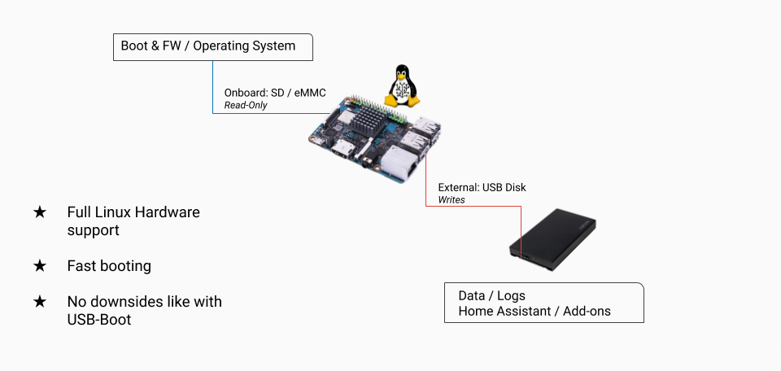

# Partition

The partition layout is a bit different than the typical setup. We prefer GPT, if possible. With SoCs which don't support GPT, we use a hybrid GPT. For more details about this topic, please refer to the [development](development.md) documentation.

The system is designed to have as few write operations to the storage media as possible. This means that we only write during the OTA updates and 5-6 times per week on the overlay partition. The data partition receives the main I/O operations and for this reason is ideal for placing on a different drive.

A visual representation looks like this:

```text
-------------------------
|       Bootloader      |
-------------------------
|       Kernel A        |
-------------------------
|       System A        |
|                       |
-------------------------
|       Kernel B        |
-------------------------
|       System B        |
|                       |
-------------------------
|       Bootstate       |
-------------------------
|       Overlay         |
|                       |
...

-------------------------
|       Data            |
|                       |
-------------------------
```

Sometime the bootloader part can look different because there can be firmware or SPLs for boot the CPU on the SoC.

## Data disk



The data partition is the only partition with real I/O. It will be expanded automatically at boot to the full size of the disk.


## Using datactl to move the data partition.

In a Home Assistant OS installation, the data is stored on the `/mnt/data` partition of the SD card. This is the only read+write partition on the SD drive. Using the `datactl` move command, this partition can be moved off of the SD card onto an externally connected drive, leaving the rest of the read-only system on the SD.

The storage capacity of the external drive must be larger than the storage capacity of the existing SD card.

The command needs to be run from the host console by either connecting a keyboard and monitor or making use of the [debug ssh access](https://developers.home-assistant.io/docs/operating-system/debugging/) over port 22222. The command will not work from within an SSH add-on container.

Log in as `root` to get to the Home Assistant CLI and then enter `login` to continue to the host.

Confirm your USB SSD/HD is connected and recognized using `fdisk -l`.

With the drive connected, use the following command (replacing sdx with your drive, without a partition number):

```sh
$ datactl move /dev/sdx
```

Enter "yes" to confirm the operation. This will prepare the disk, however, the
actual move will be running on next reboot. This will make the first boot significantly longer than usual; please be patient. Reboot with the following command:
```sh
$ ha host reboot
```

Once complete, the external drive
will contain the data and will need to be plugged in to successfully boot Home
Assistant.

## Check if the move was succesful.
Within the Home Assistant interface you won't see if the move was succesful. To check this, go to your host console again (as described above) and enter:
```sh
$ systemctl status mnt-data.mount
```
If the data partition was moved to your USB drive you should see ```sh Active: active (mounted)  ``` in the output. Also, it will show, which drive got mounted as /mnt/data (```sh Where ``` and ```sh what ``` section of the output)


## Check Power Supply Rating
Using an USB attached SSD can draw quite some power. For instance on Raspberry Pi 3 the official Raspberry Pi power supply (PSU) only provides 2.5A which can be too tight. Use a power supply which can at least provide 3.5A. Alternatively use a powered USB hub. Connect the Hub to one of the USB slots of your Raspberry Pi, and connect the SSD to the Hub. The power supply that came with the Hub will power the attached device(s).
